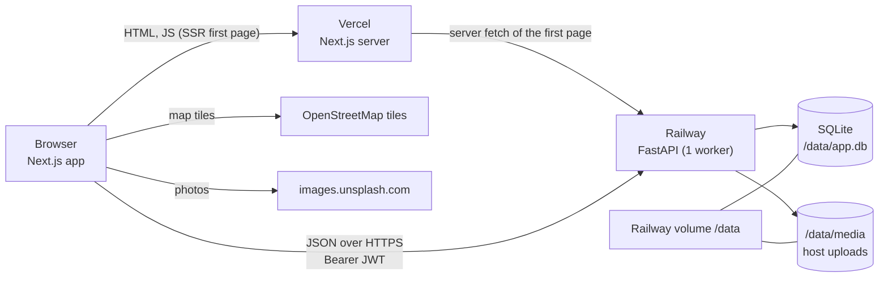
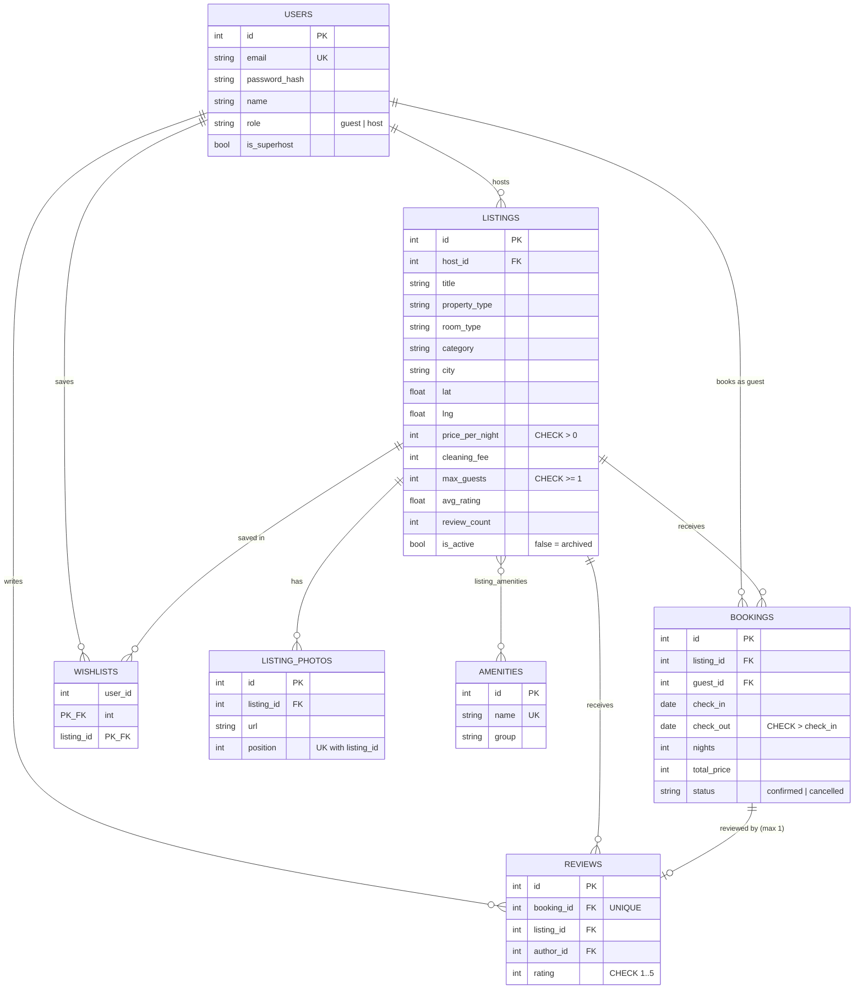

# staybnb

An Airbnb-style stays marketplace: search with dates and guests, listing pages, booking with a server-calculated price, trips, reviews, wishlists, and a host dashboard with full listing CRUD. Built for the assignment in [`Assignment Airbnb Clone.md`](Assignment%20Airbnb%20Clone.md).

**No Airbnb assets are used.** The wordmark is plain text ("staybnb"), the font is DM Sans (Google Fonts), icons come from lucide-react, and every photo is an `images.unsplash.com` URL. The reference site was only *measured* (colours, sizes, spacing, behaviour) and those measurements live in [`design-ref/design-tokens.md`](design-ref/design-tokens.md) and [`design-ref/ux-notes.md`](design-ref/ux-notes.md). The reference screenshots are not in this repository.

## Live demo

| | URL |
|---|---|
| App (Vercel) | https://airbnb-clone-cyan-mu.vercel.app |
| API (Railway) | https://api-production-a0474.up.railway.app |
| Health check | https://api-production-a0474.up.railway.app/api/health |
| Interactive API docs | https://api-production-a0474.up.railway.app/docs |

### Demo credentials

The two main demo accounts use the password `winteriscoming`; the other seeded accounts share `demo1234`.

| Role | Email | Display name | Notes |
|---|---|---|---|
| Guest | `jon.snow@north.com` | Jon Snow | Has upcoming and past trips (cancel one to fill the Cancelled tab) |
| Host | `winterfell@north.com` | Winterfell | Owns listings with bookings; use the host dashboard |

Other seeded accounts: `guest.dev@`, `guest.zara@`, `host.meera@`, `host.kabir@`, `host.isha@` (`@example.com`).

### Mock test card

Payment is a mock; nothing is charged and no card data is sent anywhere. The form only checks the format:

| Field | Value |
|---|---|
| Card number | `4242 4242 4242 4242` (any 13 to 19 digits) |
| Expiration | any `MM/YY`, for example `12/30` |
| CVV | any 3 or 4 digits |
| PIN code | any 6 digits |

## Tech stack

| Layer | Choice |
|---|---|
| Frontend | Next.js 16 (App Router), React 19, TypeScript, Tailwind CSS v4 |
| UI details | DM Sans via `next/font`, lucide-react icons, date-fns, Leaflet + react-leaflet (OpenStreetMap tiles) |
| Backend | FastAPI, SQLAlchemy 2.0, Pydantic v2, pydantic-settings |
| Auth | JWT bearer tokens (PyJWT), bcrypt password hashes |
| Database | SQLite in WAL mode (file on a Railway volume in production) |
| Tests | pytest + httpx `TestClient` |
| Hosting | Vercel (frontend), Railway (backend + volume) |

## Architecture



Design rules that shape the code (see [`CLAUDE.md`](CLAUDE.md)):

- **The backend owns business rules**: availability and overlap checks, pricing, and authorisation. The frontend shows the quote the API returns and never computes the charged total itself.
- **Design tokens only**: colours, radii, shadows, type scale, spacing and easing come from `frontend/src/app/globals.css`, which mirrors `design-ref/design-tokens.md`.
- **The booked stay lives in the URL** (`check_in`, `check_out`, `adults`, ...) so searches, listings and the checkout page are shareable and survive reloads.
- **SQLite discipline**: one uvicorn worker, WAL mode, `busy_timeout`, and `BEGIN IMMEDIATE` for the booking transaction.

## Database schema



Key constraints:

| Constraint | Where | Why |
|---|---|---|
| `check_out > check_in` | `bookings` (CHECK) | No empty or reversed stays |
| Index on `(listing_id, check_in, check_out)` | `bookings` | Fast overlap checks |
| `UNIQUE(booking_id)` | `reviews` | One review per booking |
| `rating BETWEEN 1 AND 5` | `reviews` (CHECK) | Valid scores |
| `UNIQUE(listing_id, position)` | `listing_photos` | A stable photo order |
| `price_per_night > 0`, `max_guests >= 1` | `listings` (CHECK) | Sane listings |
| Composite primary key `(user_id, listing_id)` | `wishlists` | A listing can be saved once |
| `UNIQUE(email)` | `users` | One account per email |
| `PRAGMA foreign_keys=ON` | every connection | SQLite does not enforce foreign keys by default |

Amounts are integer rupees. A listing with booking history is archived (`is_active = false`) instead of deleted, so past bookings and reviews stay intact.

## API overview

Base path `/api`. Authentication is `Authorization: Bearer <token>` from `/auth/login` or `/auth/signup`. Full schemas are in the live [`/docs`](https://api-production-a0474.up.railway.app/docs).

| Method and path | Auth | Purpose |
|---|---|---|
| `GET /health` | none | Liveness check |
| `POST /auth/signup`, `POST /auth/login`, `GET /auth/me` | none / none / user | Accounts and tokens |
| `GET /listings` | optional | Search: location, dates, guests, price, type, amenities, category, sort, pagination (returns a quote per card when dates are given) |
| `GET /listings/{id}` | optional | Listing detail (404 unknown, 410 archived) |
| `GET /listings/{id}/availability` | none | Booked ranges for the calendar |
| `GET /listings/{id}/quote` | none | Server-side price for a stay (409 if the dates are taken) |
| `GET /listings/{id}/reviews` | none | Paginated reviews |
| `GET /amenities`, `GET /categories` | none | Catalogue |
| `POST /bookings` | guest | Create a booking (atomic availability check, 409 on conflict) |
| `GET /bookings/me?status=upcoming\|past\|cancelled` | user | My trips |
| `GET /bookings/{id}` | guest or host of it | One booking |
| `POST /bookings/{id}/cancel` | guest | Cancel before check-in |
| `POST /bookings/{id}/review` | guest | Review a finished stay (one per booking) |
| `GET /wishlist`, `PUT/DELETE /wishlist/{listing_id}` | user | Saved listings |
| `POST /listings`, `PATCH /listings/{id}`, `DELETE /listings/{id}` | host (owner) | Listing CRUD; delete returns `{"result": "deleted" \| "archived"}` or 409 with upcoming bookings |
| `GET /host/listings`, `GET /host/bookings` | host | Dashboard data (bookings filterable by listing and status) |
| `POST /uploads` | host | Image upload (JPEG, PNG, WebP up to 5 MB, type sniffed from the bytes) |

Errors are `{"detail": "..."}`; validation errors (422) include per-field messages that the listing form shows inline.

## Pricing and the booking overlap rule

```
subtotal    = nightly price x nights
service fee = 14% of subtotal
total       = subtotal + cleaning fee + service fee     (integer rupees)
```

**Overlap rule.** A confirmed booking conflicts with a new request when

```
existing.check_in < new.check_out  AND  existing.check_out > new.check_in
```

Check-out day is free for the next check-in, so back-to-back stays are allowed. Cancelled bookings never block dates.

**Why `BEGIN IMMEDIATE`.** A naive "check availability, then insert" has a race: two requests for the same dates can both see "free" and both insert. In SQLite a normal transaction only takes the write lock when it first writes, which is after the check. `create_booking` therefore:

1. validates the stay (dates, guest cap, pets) without writing;
2. calls `begin_immediate(db)`, which ends any open read transaction and starts `BEGIN IMMEDIATE`, taking the database write lock **before** the check (SQLAlchemy is configured with `isolation_level=None` and a `begin` event so that this is opt-in per transaction);
3. re-runs the overlap check inside that transaction and raises `409 Conflict` if it fails;
4. inserts the booking with the prices recomputed on the server, then commits.

Concurrent writers queue on `busy_timeout=5000`, so the second request sees the first booking and gets a 409. `backend/tests/test_concurrency.py` fires simultaneous requests for overlapping dates and asserts that exactly one succeeds.

## Local setup

Requirements: Python 3.12+ and Node.js 20+.

### Backend

```bash
cd backend
python3 -m venv .venv
source .venv/bin/activate
pip install -r requirements.txt
cp .env.example .env            # optional: defaults work for local development
python -m app.seed              # fills an empty database; add --reset to rebuild everything
uvicorn app.main:app --reload --port 8000
```

API on http://localhost:8000, docs on http://localhost:8000/docs. Use a **single worker**: SQLite plus the booking lock assume one process.

### Frontend

```bash
cd frontend
npm install
cp .env.example .env.local      # NEXT_PUBLIC_API_URL=http://localhost:8000
npm run dev                     # http://localhost:3000
```

Checks: `npm run lint && npm run build`.

## Environment variables

| Variable | Where | Default | Purpose |
|---|---|---|---|
| `NEXT_PUBLIC_API_URL` | frontend (build time) | `http://localhost:8000` | Base URL of the API |
| `ENVIRONMENT` | backend | `development` | `production` enforces a strong `JWT_SECRET` |
| `DATABASE_URL` | backend | `sqlite:///./app.db` | Railway: `sqlite:////data/app.db` (on the volume) |
| `JWT_SECRET` | backend | dev-only value | Token signing key; in production at least 32 random characters |
| `JWT_EXPIRE_MINUTES` | backend | `10080` (7 days) | Token lifetime |
| `CORS_ORIGINS` | backend | `http://localhost:3000` | Comma-separated exact browser origins |
| `PUBLIC_BASE_URL` | backend | `http://localhost:8000` | Used to build URLs of uploaded images |
| `MEDIA_DIR` | backend | `backend/media` | Railway: `/data/media` (on the volume) |
| `SEED_ON_STARTUP` | backend | `false` | Seed only when the database is empty |

`.env` files are never committed.

## Tests

```bash
cd backend
source .venv/bin/activate
pytest
```

43 tests cover auth, search and filters, quotes, booking validation, the overlap rule (including back-to-back stays), cancellation, reviews, wishlists, host CRUD and ownership, uploads, and a concurrency test for the booking lock. Each run uses its own temporary seeded database.

## Project structure

```
.
├── CLAUDE.md                     project rules and domain rules
├── Assignment Airbnb Clone.md    the assignment
├── design-ref/
│   ├── design-tokens.md          measured design tokens
│   └── ux-notes.md               observed behaviour and every assumption
├── backend/
│   ├── app/
│   │   ├── main.py               app, CORS, error handler, routers
│   │   ├── config.py, db.py      settings; SQLite pragmas and BEGIN IMMEDIATE
│   │   ├── models/               SQLAlchemy models
│   │   ├── schemas/              Pydantic request and response models
│   │   ├── routers/              auth, listings, bookings, wishlist, host, uploads
│   │   ├── services/             search, availability, pricing, bookings, reviews, host
│   │   ├── seed.py, seed_data/   deterministic demo data, verified Unsplash photo ids
│   │   └── catalog.py            categories, property types, city centres
│   ├── tests/                    pytest suite
│   └── railway.json, Procfile    deployment
└── frontend/
    └── src/
        ├── app/                  routes: /, /s, /rooms/[id], /book/[id], /trips, /wishlists,
        │                         /host (+ listing forms), /login, /messages, 404 and error pages
        ├── components/           UI; listing/, booking/, host/, trips/, ui/ (Modal, Toast, SafeImg)
        └── lib/                  API client, types, hooks, formatting
```

## Assumptions and limitations

- **Payments are mocked.** The checkout form validates format only, and card details are never sent or stored. Booking creates a confirmed booking immediately; there are no refunds (cancelling before check-in just frees the dates).
- **Authentication is deliberately simple.** Email and password with a JWT kept in `localStorage`. There is no email verification, password reset, rate limiting or OAuth. The Google and Apple buttons on the phone login page are inert placeholders ("Coming soon", no brand logos). Messages and Identity verification are "Coming soon" pages.
- **Home is a grid with numbered pagination**, as the assignment asks, not the city carousels of the live site.
- **The reference never showed the booking page, the host dashboard or the toasts**, so those follow the standard Airbnb patterns. Every such choice is labelled `assumption:` in [`design-ref/ux-notes.md`](design-ref/ux-notes.md).
- **Trips pagination is client-side** (10 per page) because `/bookings/me` returns the full list.
- **SQLite means one writer.** That is fine for a demo and is exactly what the `BEGIN IMMEDIATE` design relies on; it will not scale across several API workers or instances.
- **Maps use public OpenStreetMap tiles** (light demo use). If tiles cannot load, the app shows a static price-pin fallback.
- **Hosting is Railway trial tier.** If the demo is down or slow: open the [health check](https://api-production-a0474.up.railway.app/api/health); the first request after idle time can take several seconds. If it does not answer, the trial credit may have run out or the service may be stopped, so run the project locally with the setup above (about two minutes) or redeploy with `railway up` from `backend/`. The frontend shows a "Try again" panel when the API is unreachable.
- **The demo data resets on reseed.** `python -m app.seed --reset` drops and recreates every table, which also erases bookings, reviews and listings people created. The seed is deterministic (48 listings across 8 cities, 7 accounts, past and upcoming bookings, reviews, and a distinct cover photo for each listing). Uploaded files live on the Railway volume at `/data/media`, so they survive redeploys; a reseed does not delete the files, only the rows that referenced them. Reseeding production needs a one-off start command (`python -m app.seed --reset && uvicorn ...`) because there is no shell access; `SEED_ON_STARTUP` seeds only an empty database.
- **Dates and time zones** use the server's calendar date for "past", "upcoming" and "before check-in".

